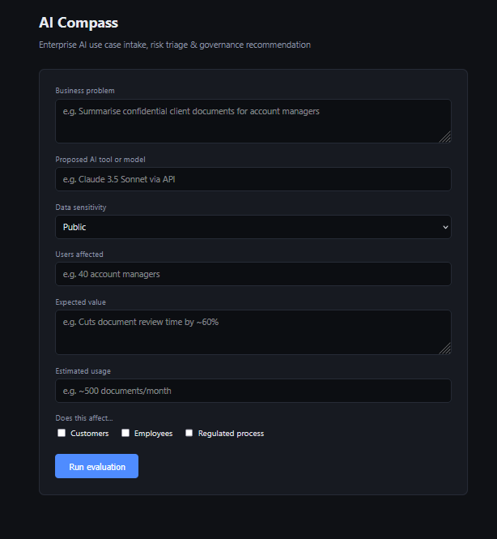
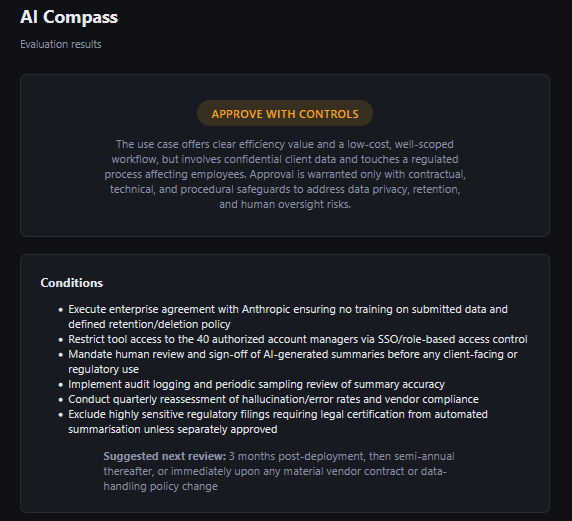
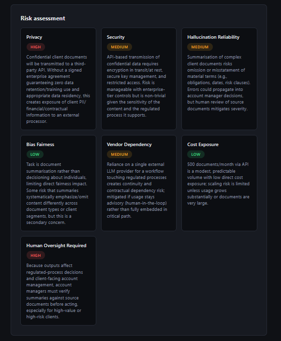
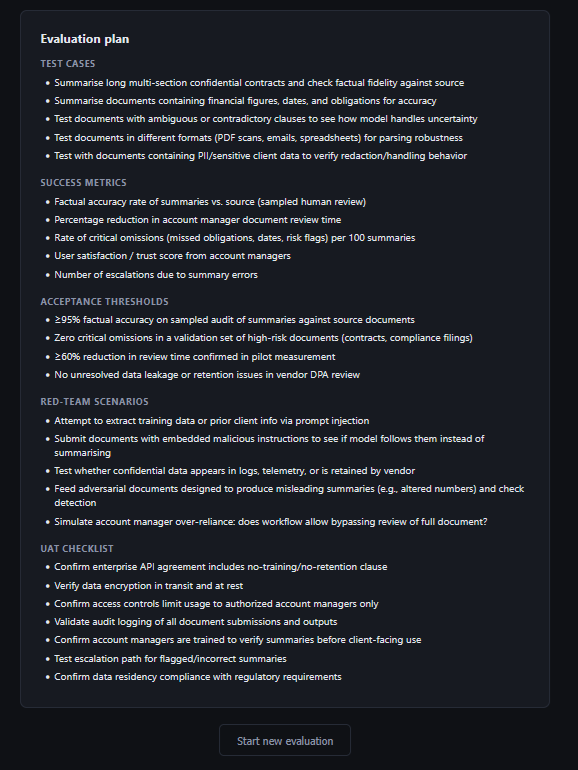
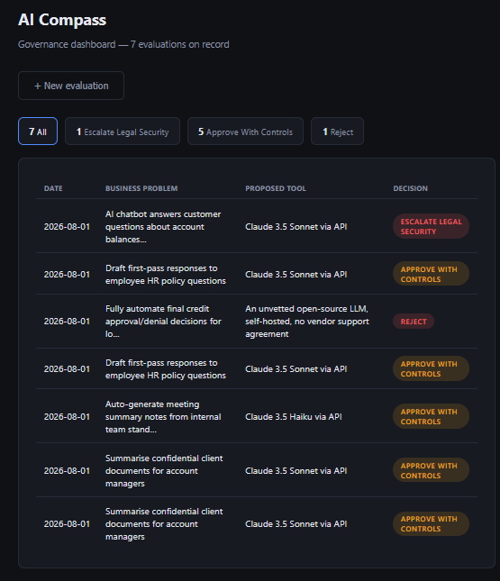

# AI Compass

An AI-assisted tool for evaluating and governing enterprise AI use cases — intake a proposal, get back a structured risk assessment, evaluation plan, governance decision, and a downloadable audit-ready evidence pack.

## Why it exists

Most organisations adopting AI tools don't have a consistent way to evaluate them. Someone proposes a use case, someone else has an opinion about the risk, and the actual decision — approve, reject, pilot first, escalate — often comes down to whoever's in the room rather than a repeatable process.

AI Compass came out of wanting to see whether that reasoning could actually be structured: given a business AI use case, could a tool consistently walk through the same risk categories, propose the same kind of evaluation plan, and land on a defensible governance decision — the way a Responsible AI or Digital Risk review board would, but in seconds instead of a multi-week review cycle. It turned into a genuinely useful exercise in prompt design, decision logic, and the gap between "the AI gave an answer" and "the AI gave a *consistent, defensible* answer."

## What it does

- **Risk assessment** across 7 categories: privacy, security, hallucination/reliability, bias/fairness, vendor dependency, cost exposure, and human oversight requirements
- **Evaluation plan** — test cases, success metrics, acceptance thresholds, red-team scenarios, and a UAT checklist
- **Governance decision** — approve, approve with controls, pilot only, reject, or escalate for Legal/Security review, with stated rationale and conditions
- **Evidence pack** — a downloadable Word document capturing the full assessment for audit purposes
- **Dashboard** — every evaluation is saved and revisitable, filterable by decision status, with running counts

## The build, version by version

**v0.1** — the core pipeline. Intake form → single structured Claude API call → risk assessment + evaluation plan + governance decision, rendered on screen, with a downloadable `.docx` evidence pack. No database — each evaluation lived only for the length of the session.

**v0.2** — persistence and a real dashboard. Every evaluation now saves to SQLite and gets a permanent, shareable URL (`/results/<id>`), so results are revisitable instead of disappearing after the session ends. Added a dashboard showing all past evaluations with status counts and filtering, and refined the governance decision logic after testing surfaced a real gap (below).

**v0.3** — in progress: live model comparison, evaluating a use case against 2-3 candidate models rather than a single fixed model.

## What actually broke, and what it taught me

Building this surfaced a handful of real bugs worth documenting honestly rather than smoothing over:

- **Response parsing failure.** Early on, `response.content[0].text` crashed with `'ThinkingBlock' object has no attribute 'text'` — the model was returning its reasoning as a separate content block before the actual answer, and the code assumed position `[0]` would always be the text. Fixed by filtering `response.content` by `.type == "text"` instead of assuming index order.

- **Token truncation.** Use cases with several High-risk categories generate longer rationales and evaluation plans — long enough that some responses got cut off mid-JSON (`Unterminated string...`), because the token budget was too tight for both the model's reasoning and the full structured output. Raised `max_tokens` and added an explicit check for `stop_reason == "max_tokens"` so future truncation fails with a clear message instead of a confusing parse error.

- **A `.gitignore` naming bug that almost leaked an API key.** Early in setup, the ignore file got saved as `gitignore` instead of `.gitignore` — missing the leading dot meant git never recognised it, and `.env` (along with `__pycache__` and some archive files) got swept into a commit. Caught before it was ever pushed, but a genuinely useful reminder to actually verify `git status` before a first commit rather than assuming a `.gitignore` file is doing its job just because it exists.

- **A governance decision-logic gap, found through structured testing rather than by accident.** Running deliberately varied scenarios through the tool — from a low-risk internal note-taking assistant up to an intentionally reckless fully-automated credit-decisioning use case — showed that a use case with zero High-rated risks and one with two High-rated risks were both landing on the same decision, "Approve With Controls." The system prompt had no explicit rule connecting *how many* risks were High to *how cautious* the final decision should be. Fixed by adding an explicit rule: two or more High-rated risk categories now requires "Pilot Only" or "Escalate" unless the proposed conditions can be shown to fully neutralise each one. Retested across the full spectrum afterward — 0 Highs, 2 Highs, 4 Highs, 7 Highs — and got a decision curve that actually tracks risk severity instead of clustering in the safe middle.

## Practical use

*(To be expanded — the short version: any organisation adopting AI tools without a formal review process could use something like this as a starting structure for intake and risk triage. More detail on this coming once v0.3 is further along.)*

## Tech stack

- **Python / Flask** — web framework
- **Anthropic Claude API** — structured risk/governance analysis (claude-sonnet-5)
- **SQLite** — evaluation persistence
- **python-docx** — generates the downloadable Word evidence pack
- **Jinja2** — templating
- **HTML / CSS** — dark, clean UI

## Getting started

**1. Clone the repo**
```bash
git clone https://github.com/SWBDevHub/AI-Compass.git
cd AI-Compass
```

**2. Install dependencies**
```bash
pip install -r requirements.txt
```

**3. Add your API key**

Create a `.env` file in the root:
```
ANTHROPIC_API_KEY=your_key_here
```

Get a key at [console.anthropic.com](https://console.anthropic.com)

**4. Run**
```bash
python app.py
```

Open `http://127.0.0.1:5000` in your browser. Click "Load demo scenario" for a ready-made example, or visit `/dashboard` to see past evaluations once you've run a few.

## Demo







## Project structure

```
aicompass/
├── app.py                       # Flask routes
├── services/
│   ├── compass_service.py       # Claude API call, structured JSON prompt/parsing
│   ├── db_service.py            # SQLite persistence
│   └── docx_service.py          # Word evidence pack generation
├── templates/
│   ├── index.html               # Intake form
│   ├── results.html             # Risk assessment, evaluation plan, governance decision
│   └── dashboard.html           # Filterable list of past evaluations
├── static/
│   └── style.css                # Dark UI styling
└── requirements.txt
```

## Skills demonstrated

- AI governance workflow design — intake, risk triage, evaluation planning, decisioning
- Structured prompt engineering — a single enforced JSON schema spanning three interdependent output sections, iteratively tightened after testing surfaced a real decision-logic gap
- Enterprise AI risk framing — privacy, security, reliability, bias/fairness, vendor dependency, cost, human oversight
- API integration — Anthropic Claude API, including debugging real response-parsing and token-limit issues
- Full-stack Python — Flask, Jinja2, REST routing, SQLite persistence, POST-redirect-GET pattern
- Document generation — python-docx for audit-ready evidence packs, built and streamed entirely in memory
- Responsible AI / audit evidence practices aligned with frameworks like NIST CSF 2.0 and ISO 27001

## Limitations & future work

This is a working prototype, not a production system. Planned additions:
- Live multi-model comparison (in progress, v0.3)
- PDF export as an alternative to the Word evidence pack
- Multi-user roles and authentication — right now every evaluation is visible to anyone running the app

## Disclaimer

AI Compass produces AI-assisted governance recommendations. All outputs should be reviewed by qualified Legal, Security, and Compliance stakeholders before any approval, pilot, or rejection decision is acted on. Not a substitute for a formal AI governance process.
